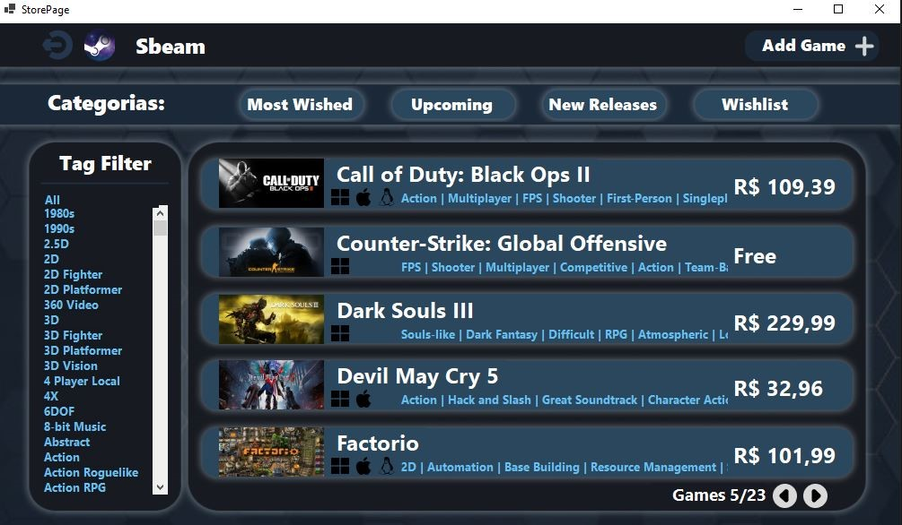
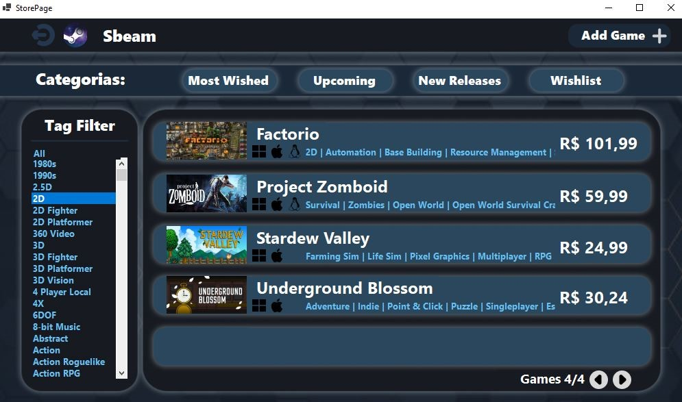
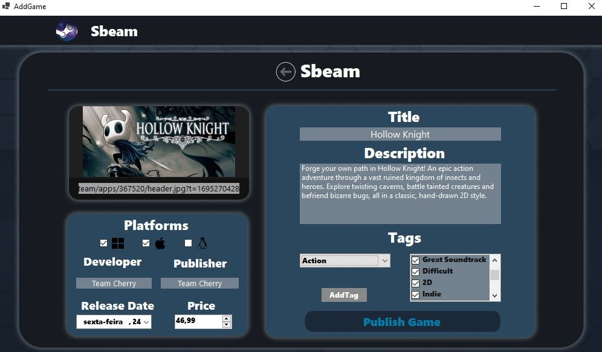

# Sbeam
Um software feito no Windows Forms utilizando  e , inspirado na loja de jogos Steam.

O programa tem algumas telas para que o usuário possa navegar e testar as funcionalidades aplicadas no aplicativo.

### Tela de login:
* Nessa aba o usuário pode entrar com um dos usuário que estão cadastrado no banco de dados, também é possivel ser direcionado para a aba de registro
caso deseje criar uma conta.

### Tela de registro

## Acessando o programa:
* O usuário ao acessar o programa, abrirá uma aba para visualizar a página principal com os jogos cadastrados e outras funcionalidades,
as fotos abaixo mostram exemplos dessas funcionalidades.
* Caso o programa detecte que o login foi efetuado por um administrador será exibido o botão `Add Game` que irá redirecionar para a página de adição de jogos.

### Filtros da Página:
* #### Tags:
   * Na barra lateral esquerda é possível selecionar dentro de uma lista de tags que filtrará a lista de jogos exibidas no centro da página. Como a foto abaixo
mostra, foi selecionada a tag `2D` e são exibidos apenas jogos que possuam a tag 2D.
* #### Categorias:
   * Na barra superior é possível selecionar dentre 1 a 4 categorias para filtrar os jogos exibidos baseado nelas. Ao clicar no botão `Upcoming` os jogos serão filtrados
    por futuros lançamentos baseado na data de lançamento armazenada.

### Página do jogo:
* Para que o usuário possa vizualizar o jogo desejado é possível clicar no título do mesmo para exibir uma página que agrega todos os dados do jogo de forma mais detalhada.

### Página de inserção:
* Caso o usuário tenha permição de administrador ele terá acesso a página `Add Game` que permitirá a inserção de jogos no programa.

